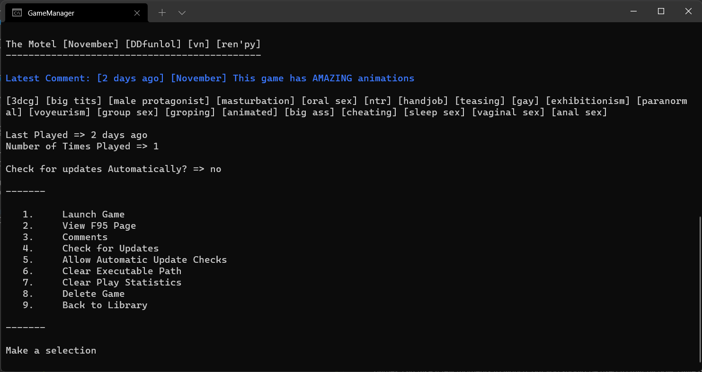

# F95 Game Manager
F95 Game Manager is a simple and fast text-based libary manager for your [F95zone](https://f95zone.to/) game library. With it you can keep track of games you find interesting, track how and when you played a game, make comment for yourself to help you remember the game between versions (or however you choose to use them), and keep track of what games you've previously deleted and why.

## Table of Contents
* [Getting Started](#getting-started)
    * [Installation](#installation)
* [Application Configuration](#application-configuration)
* [Library Management](#library-management)
* [Game Management](#game-management)
* [Data Management](#data-management)

## Getting Started

Getting started is as simple as downloading the latest release, expanding the archive, and making a few configuration choices.

### Installation
1. Download the [latest release](/releases/latest).

## Application Configuration

## Library Management

## Game Management

## Data Management

https://simple-jsoneditor.com/