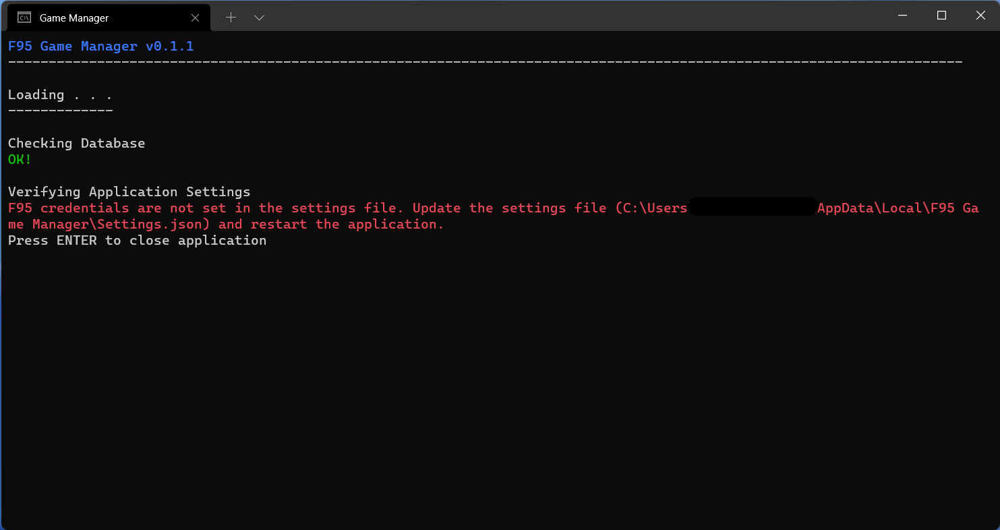
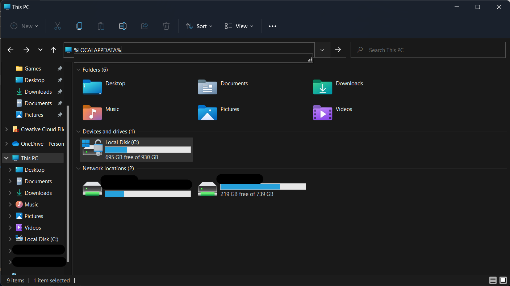

# F95 Game Manager
F95 Game Manager is a simple and fast text-based library manager for your [F95zone](https://f95zone.to/) game library. With it you can:
* keep track of games you find interesting,
* automatically check for updates to your favorite games,
* track how often and when you last played a game,
* make comments for yourself to help you remember the game between versions (or however you choose to use them)
* launch games and access the F95 forum for it,
* keep track of what games you've previously deleted and why.

## Table of Contents
* [Getting Started](#getting-started)
    * [System Requirements](#system-requirements)
    * [Installation](#installation)
    * [Initial Configuration](#initial-configuration)
* [Application Configuration](#application-configuration)
    * [The Settings File](#the-settings-file)
    * [Configuration Options](#configuration-options)
    * [Refreshing Metadata](#refreshing-metadata)
* [Library Management](#library-management)
    * [Adding a New Game](#adding-a-new-game)
    * [Check for Updates](#check-for-updates)
    * [Library Views](#library-views)
* [Game Management](#game-management)
    * [Managing Game Updates](#managing-game-updates)
* [Data Management](#data-management)

## Getting Started

Getting started is as simple as downloading the latest release, expanding the archive, and making a few configuration choices.

### System Requirements

Currently, the Game Manager is only supported on Windows. As the software is written in .NET 6.0, strictly speaking, there is no technical limitation prevent me from compiling the software for Linux/OSX other than I have no good way to test the software on those platform. As such, I have releases for Win x86/x64. According to the [.NET 6.0 documentation](https://github.com/dotnet/core/blob/main/release-notes/6.0/supported-os.md), it should run on any Windows OS newer that Windows 7 SP1. However, I have only tested it on the latest version of Windows 11 (21H2) and the oldest [supported version](https://docs.microsoft.com/en-us/windows/release-health/supported-versions-windows-client) of non-enterprise Windows 10 (20H2) and I promise it works on those platforms.

### Installation

1. Download the [latest release](https://github.com/drbakerusa/Game-Manager/releases/latest).
1. Expand the archive to a folder on your computer (any folder will do). For a little extra panache, you can right-click the `GameManager.exe` file and choose "Pin to Start" in order to make it easier to access, if you're into that sort of thing.
1. Launch the `GameManager.exe` file. You should receive an error stating that your F95 credentials are not set. This is normal and we'll fix it next.

### Initial Configuration

In order for the Game Manager to run, you must supply your F95zone username and password. The reason for this is F95zone requires you to be authenticated in order to view the latest game updates on their site (don't complain to me), so the Game Manager must also be authenticated. At this time, this is the only place where your credentials are use. However, there my be a point in the future where the integration with F95 becomes deeper. 

Those credentials are supplied to the Game Manager via a configuration file that is created when the application is first launched. Review the [Application Configuration](#application-configuration) section below for details.

Other than that, all other configuration options are preset for you :smile:

## Application Configuration

Application configuration is provided by the Settings.json file. The settings file is created (along with a the database) the first time the Game Manager is launched. On most systems, that file will live here: `"C:\Users\<<your-user-name>>\AppData\Local\F95 Game Manager\Settings.json"`. You can access Local AppData on Windows by entering `%LOCALAPPDATA%` into File Explorer.

The exact path of the the settings file is display in the error above.

### The Settings File

To edit the file, open it in any text/code editor.  If the entire file appears on one line, try using an editor that supports JSON formatting or you can use this handy [online editor](https://simple-jsoneditor.com/) instead. Simply copy the contents of the settings file into the editor window, make you changes, and copy it back when finished (click the first icon on the toolbar to format the text if it doesn't do it automatically).

### Configuration Options

The table below outlines all of the options in the settings file and what the do in the application.

| Setting Name | Default Value | What it Does |
| --- | --- | --- |
| F95Username | *blank* | Username used when Game Manager authenticates to F95zone (described [above](#initial-configuration)) |
| F95Password | *blank* | Password used when Game Manager authenticates to F95zone (described [above](#initial-configuration)) |
| DefaultPageSize | 15 | On pages where lists are dynamic (a list of games for example), this controls how many items are on a page. If you have issues with content extending out of the console or you have too much empty space, try changing this value |
| AutomaticallyCheckForGameUpdates | false | Controls whether newly added games are check for updates automatically when the application is launched. Read more about this in the [Managing Game Updates](#managing-game-updates) section below.

### Refreshing Metadata

Game Manager maintains a local cache of game metadata that is updated each time the application is launched during the bootstrapping process. The first time the application is launched after the configuration is set correctly, an initial metadata refresh will occur during which metadata for all of the games is downloaded to the local cache. Progress for this download is displayed as the number of pages being downloaded. The process should only take a minute or so to complete (depending on the speed of your internet connection).

On subsequent application launches, a delta load is performed and only new data is downloaded from F95. This process should be fairly quick.

If for some reason you need to update the metadata manually, select option 3 from the application main menu. This will present you with two options:

1. *Get latest updates only* This option will immediately perform a delta refresh of the metadata.
1. *Refresh all metadata* This option will cause the application to refresh all metadata on the next application launch.

## Library Management

Your library is the core of Game Manager and where you will spend most of your time. This section will discuss all of the options on the Library menu.

### Adding a New Game

In order to add a new game to Game Manager, you need to know the F95 thread ID value of the game. This can be found at the end of the address for the game thread in you browser.

Once you have the ID for the game you wish to add:

1. Choose option Add Game (1) option from the Library menu.
1. Enter the thread ID at the prompt.
1. Game Manager will display the metadata for the game.
1. Assuming the data, enter Y to add it to your library. Game Manager will load the game details screen so you can [manage your game](#game-management).

Game Manager has additional features when adding games:

1. If a game is already in your library and you try to add it, a yellow message will appear stating this condition.
1. If you are adding a game that you've previously [deleted](#deleting-games), a yellow message will appear stating when the game was deleted and, if provided when deleted, the reason you deleted it. This will help you avoid playing games that you already determined weren't up to your standard :smile:

### Check for Updates

The Check for Updates (2) option will scan your library for updates to your games. Read more about it in the [Managing Game Updates](#managing-game-updates) section.

### Library Views

The remaining options on the Library menu present different views of your library. The following table outlines the menu options, a description of the filtering rule used, and how the games are sorted. 

| Menu Option | How it's Filtered | How it's Sorted |
| --- | --- | --- |
| Games with Updates (3) | Shows all games with updates available | Most recently updated first |
| Recently Played (4) | Shows all games that have been played at least once | Most recently played first | 
| Ready to Play (5) | All games with an executable path set | Most recently played first, then by name if game hasn't been launched |
| Never Played (6) | Games that have never been launched | Most recently added/upgraded, then by name |
| Automatic Updates Disabled (7) | Games with check for updates automatically set to *no* | Most recently added/upgraded, then by name |
| By Name (8) | All games | Sorted by name |
| By Recently Added or Upgraded (9) | All games | Most recently added/upgraded, then by name |

## Game Management

### Managing Game Updates

### Deleting Games

## Data Management

