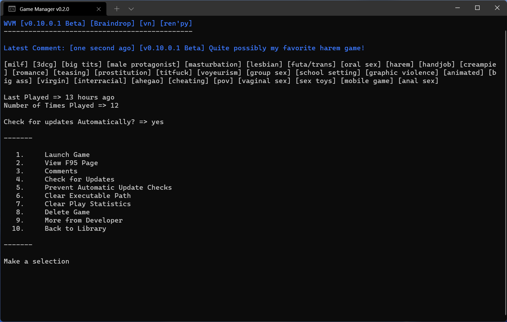
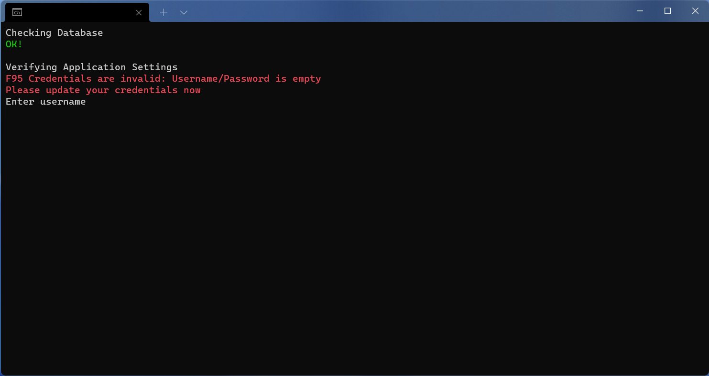
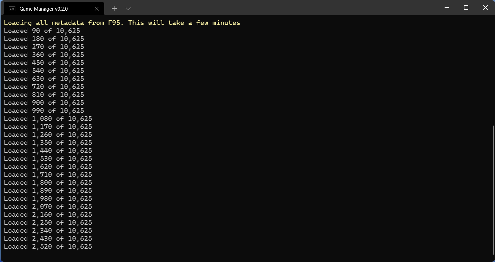
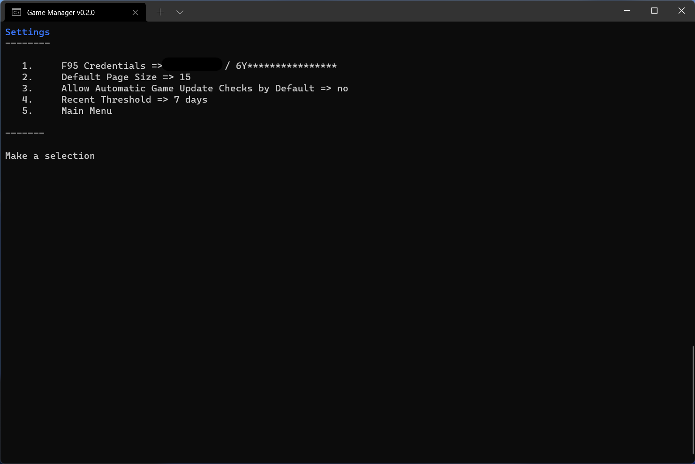
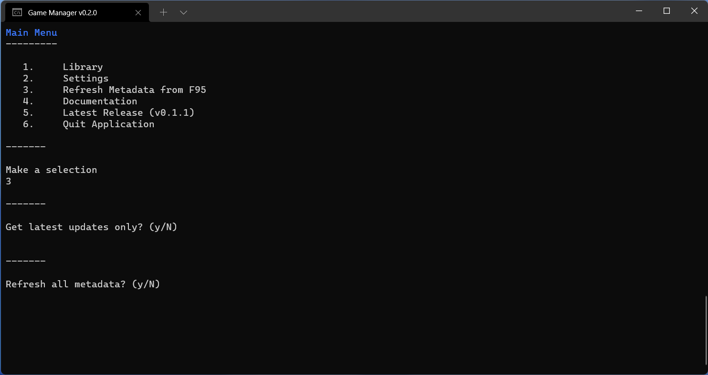
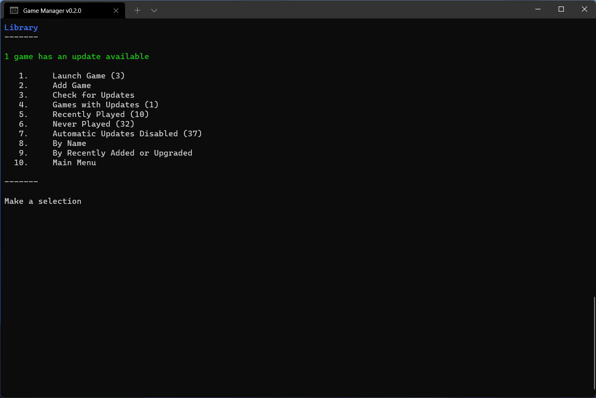
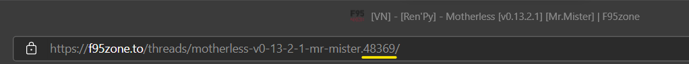
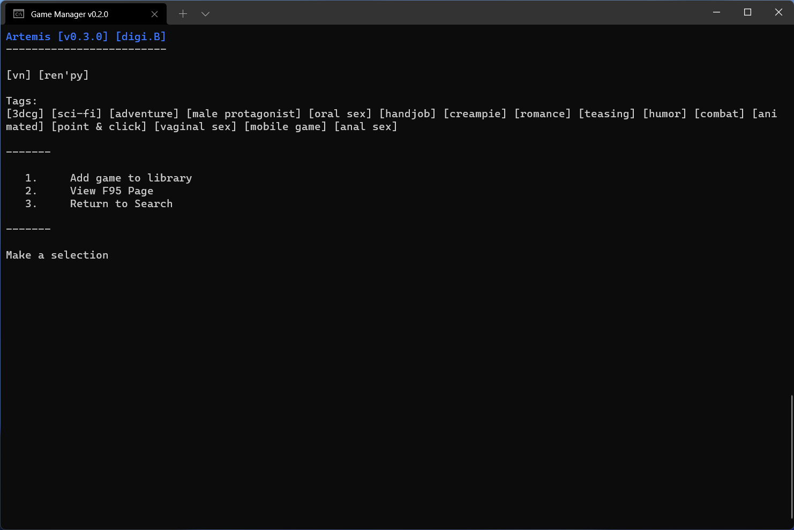
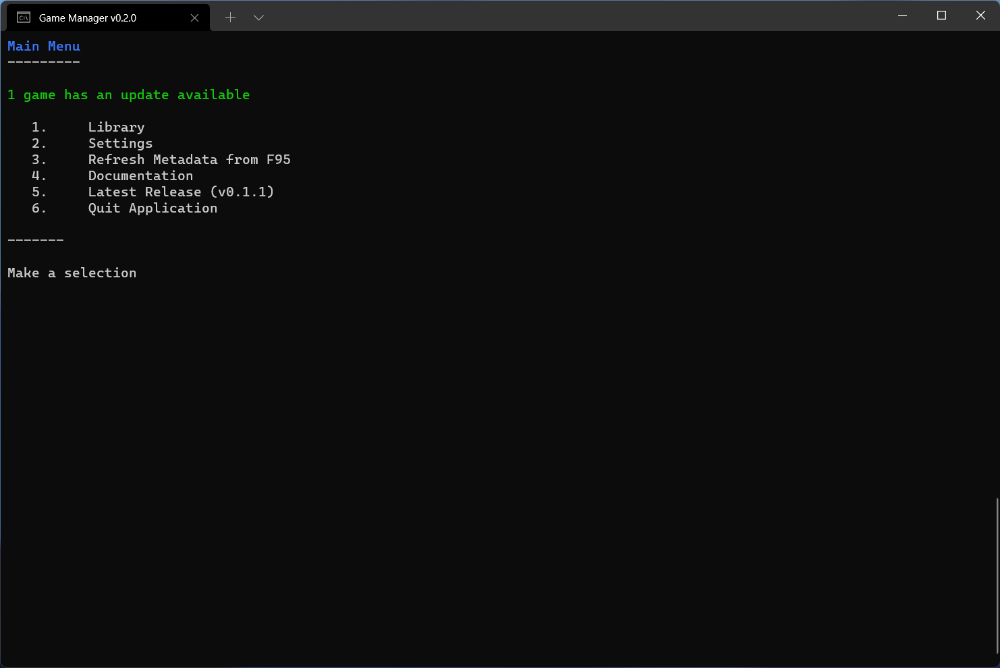

# Game Manager
Game Manager is a simple and fast text-based library manager for your [F95zone](https://f95zone.to/) game library. With it you can:
* search for games on the [F95zone](https://f95zone.to/) site by ID, URL, recently added/upgraded, name, developer, prefix or tag,
* keep track of games you find interesting,
* automatically check for updates to your favorite games,
* track how often and when you last played a game,
* make comments for yourself to help you remember the game between versions (or however you choose to use them)
* launch games and access the F95 forum for it,
* keep track of what games you've previously deleted and why.

## Table of Contents
* [Getting Started](#getting-started)
    * [System Requirements](#system-requirements)
    * [Installation](#installation)
* [Application Settings](#application-settings)
    * [Configuration Options](#configuration-options)
    * [Refreshing Metadata](#refreshing-metadata)
* [Library Menu](#library-menu)
    * [Launch Game](#launch-game)
    * [Adding a New Game](#adding-a-new-game)
    * [Check for Updates](#check-for-updates)
    * [Library Views](#library-views)
* [Adding Games](#add-games)
    * [Metadata Screen](#metadata-screen)
    * [Additional Features](#additional-features)
* [Game Management](#game-management)
    * [Launching Games](#launching-games)
    * [Comments](#comments)
    * [Managing Game Updates](#managing-game-updates)
    * [Managing Executable Paths](#managing-executable-paths)
    * [Other Features](#other-features)
* [Data Management](#data-management)
    * [Backing Up User Data](#backing-up-user-data)
    * [Moving to Another Computer](#moving-to-another-computer)

---
## Getting Started

Getting started is as simple as downloading the latest release and expanding the archive.

### System Requirements

Currently, the Game Manager is only supported on Windows. As the software is written in .NET 6.0, strictly speaking, there is no technical limitation prevent me from compiling the software for Linux/OSX other than I have no good way to test the software on those platform. As such, I have releases for Win x86/x64. According to the [.NET 6.0 documentation](https://github.com/dotnet/core/blob/main/release-notes/6.0/supported-os.md), it should run on any Windows OS newer that Windows 7 SP1. However, I have only tested it on the latest version of Windows 11 (21H2) and the oldest [supported version](https://docs.microsoft.com/en-us/windows/release-health/supported-versions-windows-client) of non-enterprise Windows 10 (20H2) and I promise it works on those platforms.

In order for the Game Manager to run, you must supply your F95zone username and password. The reason for this is F95zone requires you to be authenticated in order to view the latest game updates on their site (don't complain to me), so the Game Manager must also be authenticated. At this time, this is the only place where your credentials are use. However, there my be a point in the future where the integration with F95 becomes deeper. **Note: Multi/two factor Authentication is NOT supported!**

### Installation

1. Download the [latest release](https://github.com/drbakerusa/Game-Manager/releases/latest).
1. Expand the archive to a folder on your computer (any folder will do). For a little extra panache, you can right-click the `GameManager.exe` file and choose "Pin to Start" in order to make it easier to access, if you're into that sort of thing.
1. Launch the `GameManager.exe` file. You should receive an error stating that your F95 credentials are not set. Simply enter your F95zone username and password at the prompts.

Once the credentials are saved, Game Manager will begin a [full metadata refresh](#refreshing-metadata). This process will take a few minutes to complete (depending on your connection speed). Once the process is complete, Game Manager is ready to use!

### Application Settings

All configuration options can be set via the Settings menu (option 2 on the Main Menu). The Settings menu shows the four configurable menu options and their current values. To change one of the settings, enter the corresponding number and press enter. The settings are described in the next section.

### Configuration Options

The table below outlines all of the options in the settings file and what the do in the application.

| Setting Name | Default Value | What it Does |
| --- | --- | --- |
| F95 Credentials | *blank* | Username and password used when Game Manager authenticates to F95zone (described [above](#initial-configuration)). Credentials must be valid and Game Manager will display an error if they aren't. |
| DefaultPageSize | 15 | On pages where lists are dynamic (a list of games for example), this controls how many items are on a page. If you have issues with content extending out of the console or you have too much empty space, try changing this value |
| AutomaticallyCheckForGameUpdates | false | Controls whether newly added games are check for updates automatically when the application is launched. Read more about this in the [Managing Game Updates](#managing-game-updates) section below. |
| Recent Threshold | 7 days | Controls how "recent" searches are computed. Any where a search is available (in the Library or when searching for games to add) and the are label as "recent", results between today and _N_ days ago will be shown. |

### Refreshing Metadata

Game Manager maintains a local cache of game metadata that is updated each time the application is launched during the bootstrapping process. The first time the application is launched, an initial metadata refresh will occur during which metadata for all of the games is downloaded to the local cache. Progress for this download is displayed as the number of games being downloaded. The process should only take a minute or so to complete (depending on the speed of your internet connection).

On subsequent application launches, a delta load is performed and only new data is downloaded from F95. This process should be fairly quick.

If for some reason you need to update the metadata manually, select option 3 from the application main menu. This will present you with two options:

1. *Get latest updates only (delta refresh)* This option will immediately perform a delta refresh of the metadata.
1. *Refresh all metadata (full refresh)* This option will cause the application to refresh all metadata.

---
## Library Menu

Your library is the core of Game Manager and where you will spend most of your time. This section will discuss all of the options on the Library menu.

### Launch Game

Option 1 on the Library menu is "Launch Game." This option will display all games in your library for which a valid executable has been specified. Selecting a game will launch the executable and show the game details.

### Adding a New Game

Option 2 will launch the Add Game menu. That menu is discussed in detail in the [next section](#add-games).

### Check for Updates

The Check for Updates (3) option will cause Game Manager to perform a [delta refresh](#refreshing-metadata) and then scan your library for updates to your games. Read more about it in the [Managing Game Updates](#managing-game-updates) section.

### Library Views

The remaining options on the Library menu present different views of your library. The following table outlines the menu options, a description of the filtering rule used, and how the games are sorted. 

| Menu Option | How it's Filtered | How it's Sorted |
| --- | --- | --- |
| Games with Updates (4) | Shows all games with updates available | Most recently updated first |
| Recently Played (5)[^1] | Shows all games that have been played at least once recently | Most recently played first | 
| Never Played (6) | Games that have never been launched | Most recently added/upgraded, then by name |
| Automatic Updates Disabled (7) | Games with check for updates automatically set to *no* | Most recently added/upgraded, then by name |
| By Name (8) | All games | Sorted by name |
| By Recently Added or Upgraded (9)[^1] | All games | Most recently added/upgraded, then by name |

[^1]: These menu options are limited by the "Recent Threshold" described in the [Configuration Options](#configuration-options) section.

---

## Add Games

There are a number of options in Game Manager by which you and discover/add games to your library. This section outlines each of those methods.

1. By Thread ID : This options requires the ID of the F95zone forum. This is located at the end of the URL for the game forum.  Simply enter the ID at the prompt and hit Enter.
1. By Forum URL: Simply copy the entire forum URL from the image above and press Enter.
1. Recently Updated: This shows all the recently[^1] updated games on the F95zone site.  

The remaining four options will search by the specified attribute. In the case of tags and prefixes, a list will be presented of all the options available. Choosing one will search by that tag or prefix.

### Metadata Screen

Regardless of the method you use to find a game, you will be presented with the following screen:

The metadata screen has the following three options:

1. Add game to library (1): Unsurprisingly, this will add the game to your library and navigate you to the library details screen for that game. From that screen you can manage the game as described in the [Game Management section](#game-management).
1. View F95 Page (2): This will open the F95 forum for the game in your default browser. This is particularly useful if you've searched for a game rather than entering the ID or URL.
1. Return to Search: This will return to the [Add Game screen](#add-games).

### Additional Features

Game Manager has additional features when adding games:

1. If a game is already in your library and you try to add it, a yellow message will appear stating this condition and option 1 will change to "View game in library".
1. If you are adding a game that you've previously [deleted](#deleting-games), a yellow message will appear stating when the game was deleted and, if provided when deleted, the reason you deleted it. This will help you avoid playing games that you already determined weren't up to your standard. :smile:

---

## Game Management

Games, the reason Game Manager exists at all. This section outlines everything you can do to a game.

### Launching Games

The first option on the game menu toggles between *Launch Game* and *Add Game Launch* depending on whether an [executable path](#managing-executable-paths) is set. When an executable path is set, choosing this option with, unsurprisingly, launch the game. 

**Note, games, especially Ren'py games, can take a few moments to launch, but you should be used to that by now**. 

When the executable path is not set, this option will add a game launch, incrementing the counter and setting the last played time to *now*, but the game won't automatically launch.

The details screen displays how many times a game has been launch and when the last launch occurred. Additionally, these statistics can be cleared by choosing the *Clear Play Statistics (7)* option. These statistics are used as sort options for some of the [library views](#library-views).

### Comments

Choosing the Comments (3) option will load the comments manager. From there you can add and remove game comments. When a game has at least one comment, the game details will show the latest comment as shown in the image above.

### Managing Game Updates

Game Manager can be configured to automatically check for updates to games in your library. By default, games are added to your library with automatically check for updates set to *no*. If you would like for new games to be automatically checked for updates, you can change this in the [application settings](#application-settings). 

Game Manager will automatically check for updates for all games with automatically check for updates set to *yes* each time the application is launched. You can also check the entire library from the option on the [library menu](#check-for-updates).

The game details screen offers the following options to manage game updates:

* *Check for Updates* (4) : This will cause Game Manager to perform a [delta refresh](#refreshing-metadata) and then check for updates for the current game. This option is only available if the game doesn't have updates pending.
* *Apply Updates* (4) : This option will apply the current update to the game by performing the following steps

    1. Update the metadata values for the version, tags, and prefixes.
    1. Clear the game executable path. After the game is updated, you will need to reset the path to the executable for the new version. Read more about that [below](#managing-executable-paths)

* *Prevent/Allow Automatic Update Checks* :  Will toggle the Check for Update Automatically between yes and no.

When Game Manager discovers and update for a game, it will display it in two places: on the main menu  and on the game details screen. 

### Managing Executable Paths

Option 6 will allow you to set the execution path for the game. Setting the executable path for a game creates a link between Game Manager and the game files. Once this link is establish, Game Manager can automatically launch a game and track play statistics as mentioned in the [launching games](#launching-games) section.

To set the executable path, choose *Set Executable Path* (6) from the menu and enter the path. If an executable path is already set, this option will show "Clear Executable Path". Its function should be pretty obvious.

> **Tip**: Windows offers a simple way to get the path. Simply select the file and, on Windows 10, choose *Copy Path* from the Home tab on the Ribbon and on Windows 11, right-click the file and choose *Copy as path* then paste the path into Game Manager.
>
> 
>
> 

If a game already has an executable path set, option 6 will change to *Clear Executable Path*. Choosing this option will clear the path (as expected). This is useful if you need to change the path or you have deleted the game files from your hard disk.

### Deleting Games

Unsurprisingly, deleting a game will remove it from your library. That isn't the end of the story however. Game Manager will allow you to add a reason when you delete a game. This is stored in the database and will be display if you attempt to add a game that you have deleted previously. It is recommended that you add an informative reason as a note to yourself whenever you delete a game.

Deleting a game will delete all information about the game from the database including any comments you have made. **This cannot be reversed!**

To delete a game:

1. Open the game details screen
1. Choose the *Delete Game* (8) option
1. Confirm that you want to delete
1. Enter your reason if desired

### Other Features

(2) View F95 Game: This will open the F95 forum for this game in you default browser.

(9) More from Developer: This will perform a search for more games by the same developer. Useful if you just want to see more goodness.

---

## Data Management

Game Manager requires very little in terms of data management, but this section covers what you need to know.

Game Manager uses three data files

* GameManager.db : This is your library database.
* Controls.json : This contains settings that are internal to the application and requires no direct user interaction.
* Settings.json : This is your user settings for the application. It is document [above](#the-settings-file).

On most systems, these files will live here: `"C:\Users\<<your-user-name>>\AppData\Local\F95 Game Manager"`. 
> **Tip**: You can access Local AppData on Windows by entering `%LOCALAPPDATA%` into File Explorer.
>
>

### Backing Up User Data

To backup your data:

1. Ensure that the Game Manager is not running.
1. Navigate to the folder mentioned above.
1. Copy the three data files (GameManager.db, Settings.json, and Controls.json) to a backup location.

### Moving to Another Computer

1. [Backup your data](#backing-up-user-data)
1. [Install Game Manager](#installation) on the new computer.
1. Copy the backed up data to the folder mentioned above.
